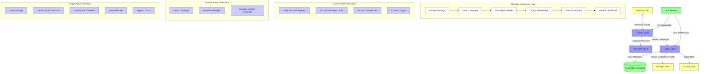

```mermaid
graph TD
    %% Main Agent Components
    WhatsApp[WhatsApp API]
    HubSpot[HubSpot CRM]
    Excel[Excel Export]
    DB[(PostgreSQL Database)]
    
    %% Agents
    ListenerAgent[Listener Agent]
    TranslatorAgent[Translator Agent]
    LoggerAgent[Logger Agent]
    
    %% Agent Relationships and Data Flow
    WhatsApp <--> |Webhook Events| ListenerAgent
    ListenerAgent --> |Process Messages| LoggerAgent
    ListenerAgent --> |Language Detection| TranslatorAgent
    
    LoggerAgent --> |Store Messages| DB
    LoggerAgent --> |Create Contacts & Tickets| HubSpot
    LoggerAgent --> |Export Data| Excel
    
    %% Settings Connection
    UserSettings[User Settings] --> |API Credentials| ListenerAgent
    UserSettings --> |CRM Preferences| LoggerAgent
    
    %% Message Processing Flow
    subgraph "Message Processing Flow"
        direction LR
        Receive[Receive Message] --> Detect[Detect Language]
        Detect --> Translate[Translate if needed]
        Translate --> Categorize[Categorize Message]
        Categorize --> Store[Store in Database]
        Store --> CRM[Send to CRM/Excel]
    end
    
    %% Agent Functions
    
    subgraph "Listener Agent Functions"
        direction TB
        VerifyRequest[Verify Webhook Request]
        ProcessMessage[Process Message Content]
        ExtractCustomer[Extract Customer Info]
        RouteMessage[Route to Logger]
    end
    
    subgraph "Translator Agent Functions"
        direction TB
        DetectLanguage[Detect Language]
        TranslateToEnglish[Translate to English]
        TranslateToOther[Translate to Other Language]
    end
    
    subgraph "Logger Agent Functions"
        direction TB
        StoreMessage[Store Message]
        CreateCustomer[Create/Update Customer]
        CreateOrder[Create Order if Needed]
        SyncCRM[Sync with CRM]
        ExportExcel[Export to Excel]
    end
    
    %% Styling
    classDef agent fill:#9999ff,stroke:#333,stroke-width:1px;
    classDef external fill:#ffff99,stroke:#333,stroke-width:1px;
    classDef database fill:#99ff99,stroke:#333,stroke-width:1px;
    classDef flow fill:#f9f9f9,stroke:#999,stroke-width:1px;
    classDef function fill:#ccccff,stroke:#666,stroke-width:1px;
    
    class ListenerAgent,TranslatorAgent,LoggerAgent agent;
    class WhatsApp,HubSpot,Excel external;
    class DB,UserSettings database;
    class Receive,Detect,Translate,Categorize,Store,CRM flow;
    class VerifyRequest,ProcessMessage,ExtractCustomer,RouteMessage,DetectLanguage,TranslateToEnglish,TranslateToOther,StoreMessage,CreateCustomer,CreateOrder,SyncCRM,ExportExcel function;
```
