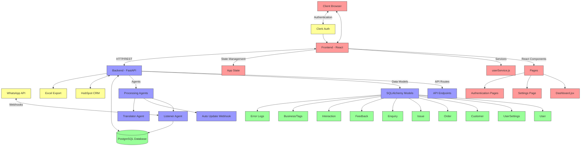

```mermaid
graph TD
    %% Main Components
    Client[Client Browser]
    FrontEnd[Frontend - React]
    BackEnd[Backend - FastAPI]
    DB[(PostgreSQL Database)]
    WhatsApp[WhatsApp API]
    HubSpot[HubSpot CRM]
    Excel[Excel Export]
    
    %% Frontend Components
    FrontEnd --> |React Components| Pages
    Pages --> Dashboard[Dashboard.jsx]
    Pages --> Settings[Settings Page]
    Pages --> Auth[Authentication Pages]
    
    FrontEnd --> |Services| UserService[userService.js]
    FrontEnd --> |State Management| AppState[App State]
    
    %% Backend Components
    BackEnd --> |API Routes| Routes[API Endpoints]
    BackEnd --> |Data Models| Models[SQLAlchemy Models]
    BackEnd --> |Agents| Agents[Processing Agents]
    
    %% Agents
    Agents --> ListenerAgent[Listener Agent]
    Agents --> AutoUpdateWebhook[Auto Update Webhook]
    Agents --> TranslatorAgent[Translator Agent]
    
    %% Models
    Models --> UserModel[User]
    Models --> SettingsModel[UserSettings]
    Models --> CustomerModel[Customer]
    Models --> OrderModel[Order]
    Models --> IssueModel[Issue]
    Models --> EnquiryModel[Enquiry]
    Models --> FeedbackModel[Feedback]
    Models --> InteractionModel[Interaction]
    Models --> BusinessModel[Business/Tags]
    Models --> ErrorLogModel[Error Logs]
    
    %% Data Flow
    Client <--> FrontEnd
    FrontEnd <--> |HTTP/REST| BackEnd
    BackEnd <--> DB
    
    %% External Integrations
    WhatsApp <--> |Webhooks| ListenerAgent
    ListenerAgent --> DB
    BackEnd <--> HubSpot
    BackEnd --> Excel
    
    %% Authentication Flow
    Client <--> |Authentication| Clerk[Clerk Auth]
    Clerk --> FrontEnd
    
    %% Styling
    classDef frontend fill:#ff9999,stroke:#333,stroke-width:1px;
    classDef backend fill:#9999ff,stroke:#333,stroke-width:1px;
    classDef database fill:#99ff99,stroke:#333,stroke-width:1px;
    classDef external fill:#ffff99,stroke:#333,stroke-width:1px;
    
    class Client,FrontEnd,Pages,Dashboard,Settings,Auth,UserService,AppState frontend;
    class BackEnd,Routes,Models,Agents,ListenerAgent,AutoUpdateWebhook,TranslatorAgent backend;
    class DB,UserModel,SettingsModel,CustomerModel,OrderModel,IssueModel,EnquiryModel,FeedbackModel,InteractionModel,BusinessModel,ErrorLogModel database;
    class WhatsApp,HubSpot,Excel,Clerk external;
```
