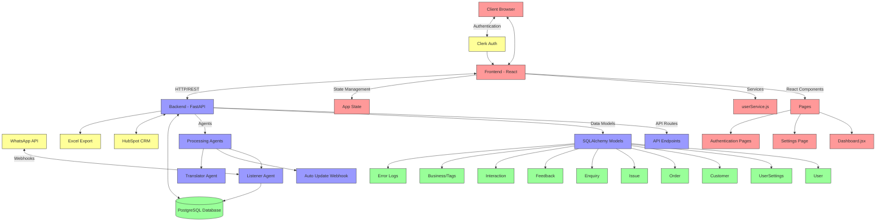

# WAffy Dashboard Architecture

## Overview
WAffy Dashboard is a WhatsApp message management system that organizes messages, tags customer chats, and synchronizes with CRM systems. The architecture follows a modern client-server pattern with a React frontend and FastAPI backend.

## Component Details

### Frontend (React)
- **Authentication**: Uses Clerk for user authentication
- **UI Framework**: Tailwind CSS for styling with a pink-to-yellow gradient theme
- **Key Pages**:
  - Dashboard: Displays orders, customers, enquiries, and issues with filtering capabilities
  - Settings: Manages user profile, business details, and integration settings
- **Services**:
  - userService.js: Handles API communication with the backend

### Backend (FastAPI)
- **API Endpoints**: RESTful endpoints for CRUD operations on all data models
- **Data Models**: SQLAlchemy ORM models for database interaction
- **Agents**:
  - Listener Agent: Processes incoming WhatsApp messages
  - Auto Update Webhook: Configures WhatsApp API webhooks
  - Translator Agent: Handles message translation if needed

### Database (PostgreSQL)
- **Core Tables**:
  - Users: Stores user information and authentication details
  - UserSettings: Stores user preferences and API credentials
  - Customers: Customer information
  - Orders: Order details including items, quantity, unit, and status
  - Issues: Customer issues and their resolution status
  - Enquiries: Customer inquiries and follow-up information
  - Interactions: Records of customer interactions

### External Integrations
- **WhatsApp API**: Connects via webhooks to receive and send messages
- **HubSpot CRM**: Creates contacts, notes, and tickets for high-priority messages
- **Excel Export**: Alternative to CRM for exporting customer data

## Data Flow

1. **Message Reception**:
   - WhatsApp sends messages to the Listener Agent via webhooks
   - Messages are processed, categorized, and stored in the database

2. **User Authentication**:
   - Users authenticate via Clerk
   - Backend validates user identity and provides user-specific data

3. **Dashboard Operations**:
   - Frontend requests data filtered by the logged-in user's ID
   - Backend returns only data relevant to the authenticated user
   - Data is displayed with the latest entries first

4. **CRM Integration**:
   - High-priority messages trigger HubSpot ticket creation
   - Customer information is synchronized with the CRM

5. **Settings Management**:
   - User updates WhatsApp API credentials
   - Backend encrypts sensitive data before storage
   - Auto Update Webhook configures the WhatsApp API webhook

## Security Features
- Encryption of sensitive API keys and tokens
- User-specific data filtering
- Clerk authentication integration
- Secure webhook verification
